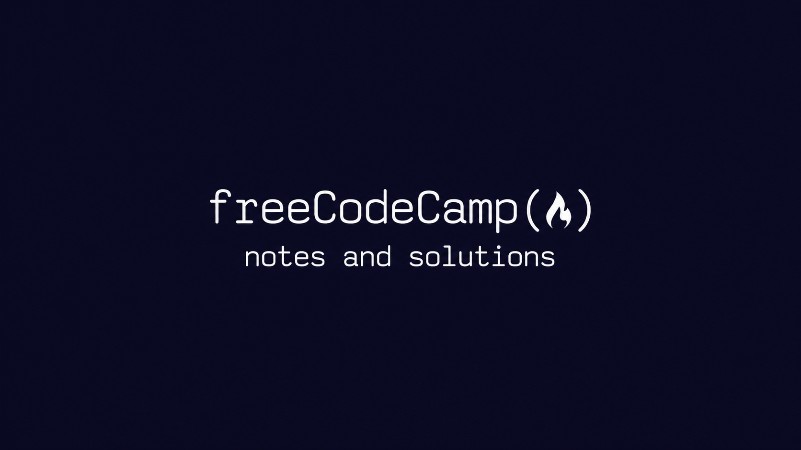

# FreeCodeCamp Documented Solutions

This repository contains my personal solutions, explanations and technical notes for the FreeCodeCamp exercises I completed.

The main goal of this repository is to document my learning process, strengthen my understanding through written explanations, and organize my technical studies in a structured way.

---

# Topics Covered

- Python
- SQL & PostgreSQL
- Bash
- Git & GitHub
- Object-Oriented Programming
- Data Structures
- Algorithms

---

# Repository Structure

```text
freecodecamp-notes-and-solutions/
│
├── git-github/
├── bash/
├── python/
├── sql/
└── README.md
```

Each module contains:
- Exercise solutions
- Personal explanations
- Technical notes
- Additional observations and practical applications

---

# Learning Approach

For every exercise, I try to:
1. Solve the problem on my own
2. Understand the logic behind the solution
3. Explain the concept using my own words
4. Document important ideas and common mistakes

---

# Technologies

- Python
- PostgreSQL
- SQL
- Bash
- Git
- Linux

---

# Purpose

This repository is part of my continuous learning journey in:
- Software Engineering
- Data Analysis
- Automation
- Backend Development
- Data Engineering foundations

---

# Notes

- All explanations are written by me as part of my study process
- Solutions are organized by module/course
- The repository will continue to grow as I complete new topics and projects
